### [Eduonix] ReactJS and Flux: Learn By Building 10 Projects [ENG, 2016]

https://www.youtube.com/watch?v=S8ArGSiYYBw

___

 

### 01 Bootstrap React Components

**002 Setup React Bootstrap**

    https://facebook.github.io/react/
    http://getbootstrap.com/
    https://cdnjs.com/libraries/babel-core
    http://getbootstrap.com/examples/jumbotron/
    http://getbootstrap.com/components/#navbar

**003 Creating React Components**

**004 Component Props**

**005 Working With State**

 

### 02 Github Profile Viewer

Technologies: jquery, bootstrap, webpack

**002 Files Webpack Setup**

GithHub --> Settings --> OAuth applications --> Developer applications --> Register a new OAuth application

    Application name: myApp
    Homepage URL: http://localhost:8080
    Authorization callback URL: http://localhost:8080/_eauth/github

 

    # npm install -g webpack --no-optional
    # npm install -g webpack-dev-server --no-optional

 

    # npm init
    # npm install

 

    # webpack-dev-server --port 8080 --hot --host 0.0.0.0

 

    $ curl -I http://localhost:8080
    HTTP/1.1 200 OK
    X-Powered-By: Express
    Content-Type: text/html; charset=utf-8
    Content-Length: 7730
    Date: Sat, 25 Jun 2016 13:12:31 GMT
    Connection: keep-alive

 

    $ links http://localhost:8080/app

 

browser --> localhost:8080/app/

 

**003 Main App Component**

http://getbootstrap.com/examples/starter-template/

 

**004 Profile Component**

 

**005 RepoList Repo Components**

 

**006 Search Component**

 

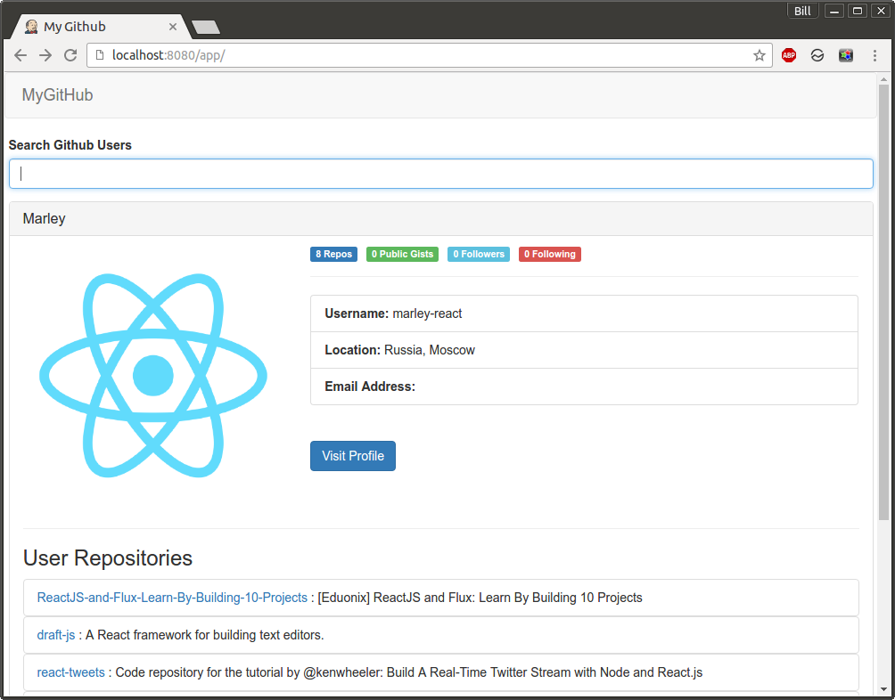

 

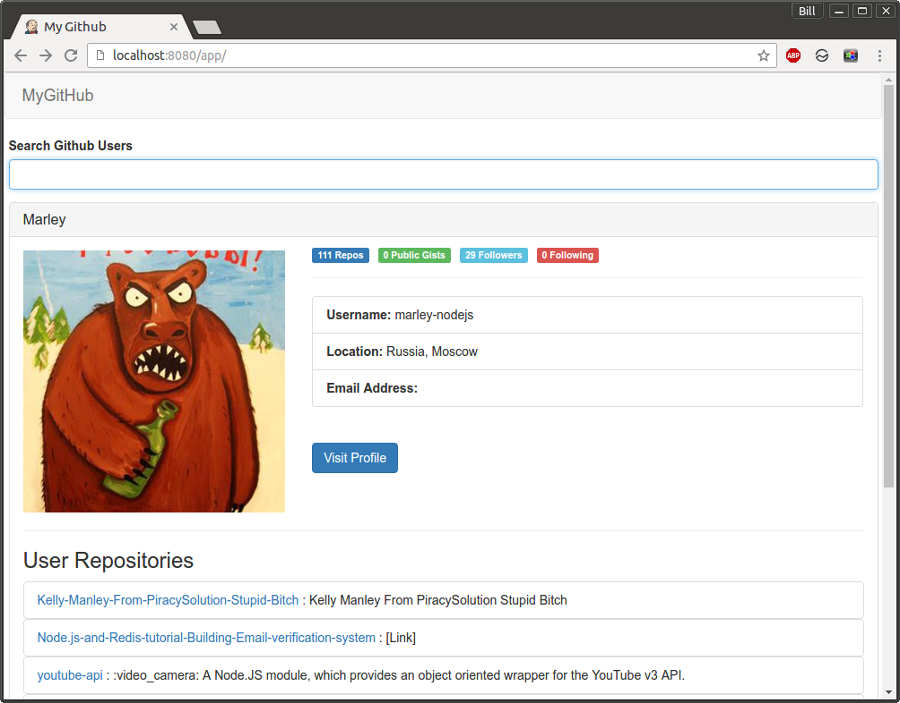

 

Update next valuers to run app:

    clientId: 'myClientId',
    clientSecret: 'myClientSecret'

 

### 03 Quick Quiz Application

Technologies: bootstrap, webpack

 

002 App Component Setup

    $ npm init
    $ npm install

    $ webpack-dev-server --port 8080 --hot --host 0.0.0.0

browser --> localhost:8080/app/

 

003 QuestionList Question Component

 

004 Quiz Logic

 

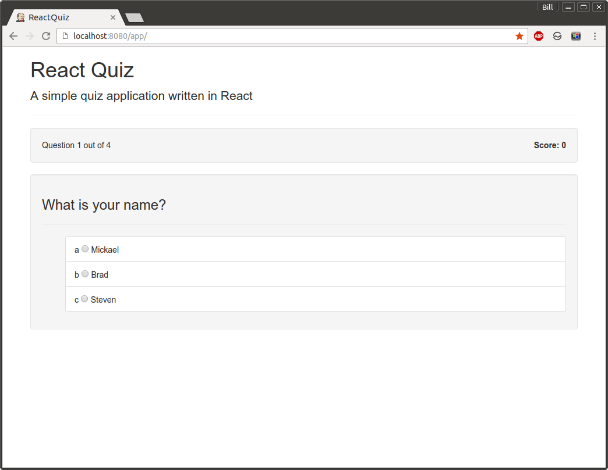

 

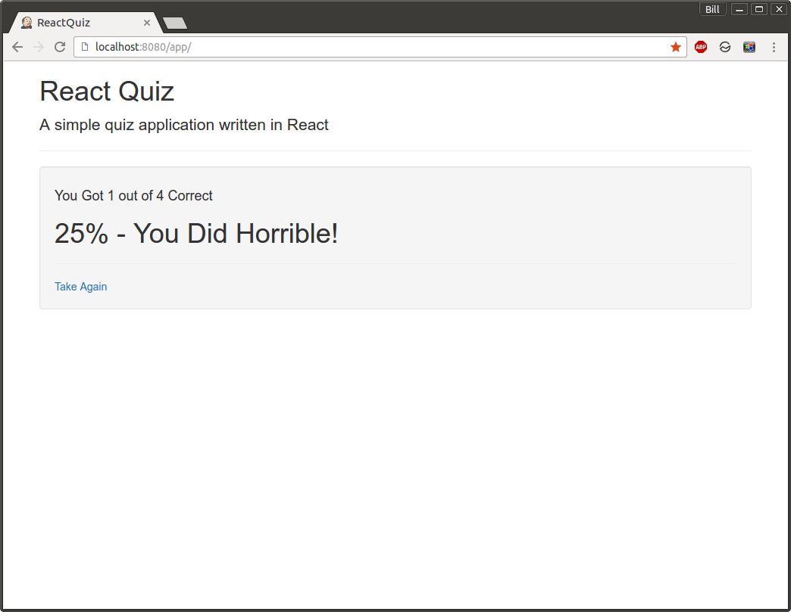

 

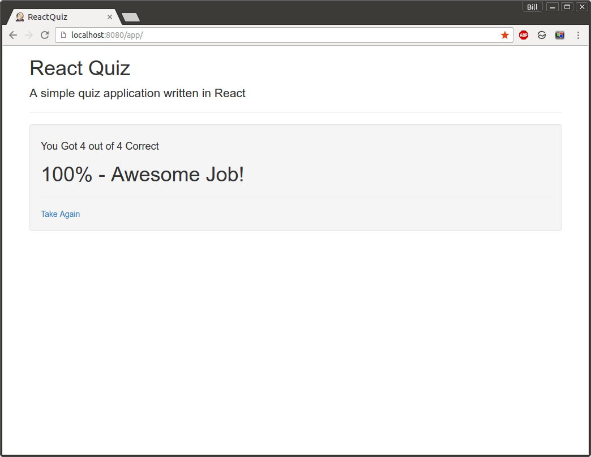

 

### 04 MovieFind

Technologies: bootstrap, jquery, gulp, flux

 

002 Flux Structure Gulp Part

http://facebook.github.io/flux/docs/overview.html

http://omdbapi.com/

    $ npm init
    $ npm install

 

    $ gulp

 

004 Flux Setup Preperation

 

006 SearchForm Component

 

007 Working With The API

 

008 Displaying Results

 

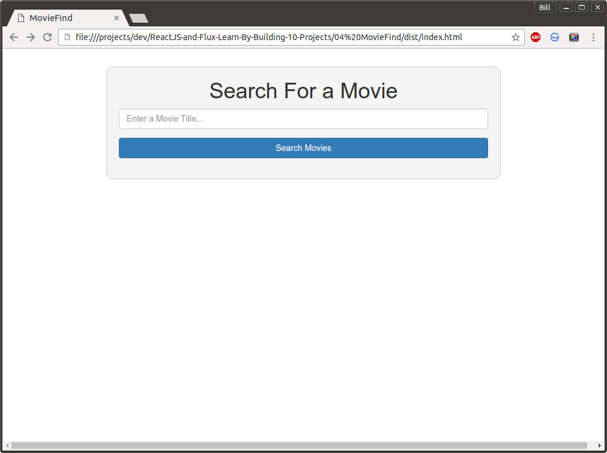

 

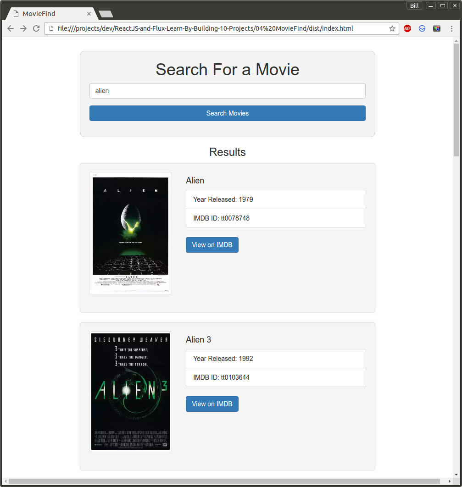

    $ npm list -g --depth=0
    /usr/local/lib
    ├── gulp@3.9.1
    ├── npm@3.9.5
    ├── webpack@1.13.1
    └── webpack-dev-server@1.14.1

 

    $ npm list --depth=0
    04_moviefind@1.0.0 /projects/04 MovieFind
    ├── browserify@13.0.1
    ├── flux@2.1.1
    ├── gulp@3.9.1
    ├── object-assign@2.1.1
    ├── react@0.14.8
    ├── react-dom@0.14.8
    ├── reactify@1.1.1
    └── vinyl-source-stream@1.1.0

 

### 05 Firebase ContactList

Technologies: Firebase

firebase.com

 

002 Flux Boilerplate Setup

Create New App:

App Name: ContactList  
App URL: contactlist9  

    $ npm install
    $ gulp

 

003 Adding Contacts To Store

 

004 Persisting Data To Firebase

    $ npm install --save firebase@2.*.*

 

005 Listing Deleting Contacts

 

007 Edit Update Contacts

 

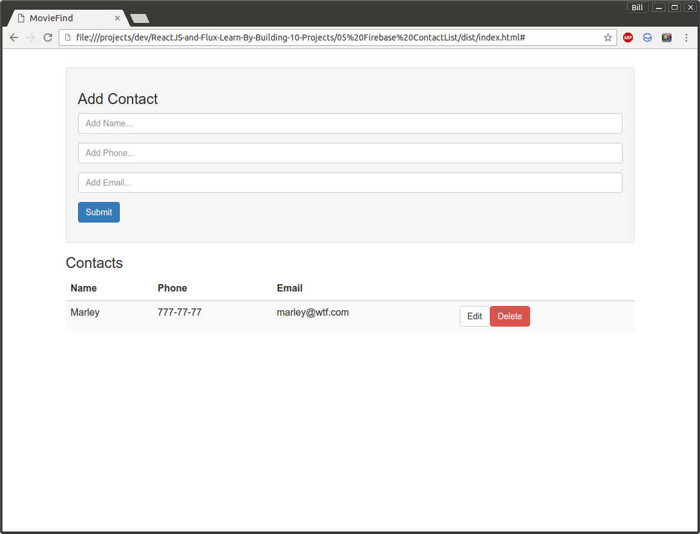

 

 

    # npm list --depth=0
    05_Firebase_ContactList@1.0.0 /projects/05 Firebase ContactList
    ├── browserify@13.1.0
    ├── firebase@2.4.2
    ├── flux@2.1.1
    ├── gulp@3.9.1
    ├── object-assign@2.1.1
    ├── react@0.14.8
    ├── react-dom@0.14.8
    ├── reactify@1.1.1
    └── vinyl-source-stream@1.1.0

 

### 06 Stickypad Notes

Technologies: Flux, Mongolab

 

002 Stickypad Boilerplate Setup

mongolab.com

    Create New ->
    Cloud Provider --> Amazon
    Plan -->Single-node --> Sandbox

    Database name: stickypad1

    Add Database User: marley

 

    $ npm install
    $ gulp

 

003 AddNoteForm Component

 

004 Add Fetch Notes From MongoLab

mongolab.com --> UserProfile --> Api Key

AppAPI.js add your API KEY.

 

005 Display Sticky Notes

 

006 Delete Sticky Notes

 

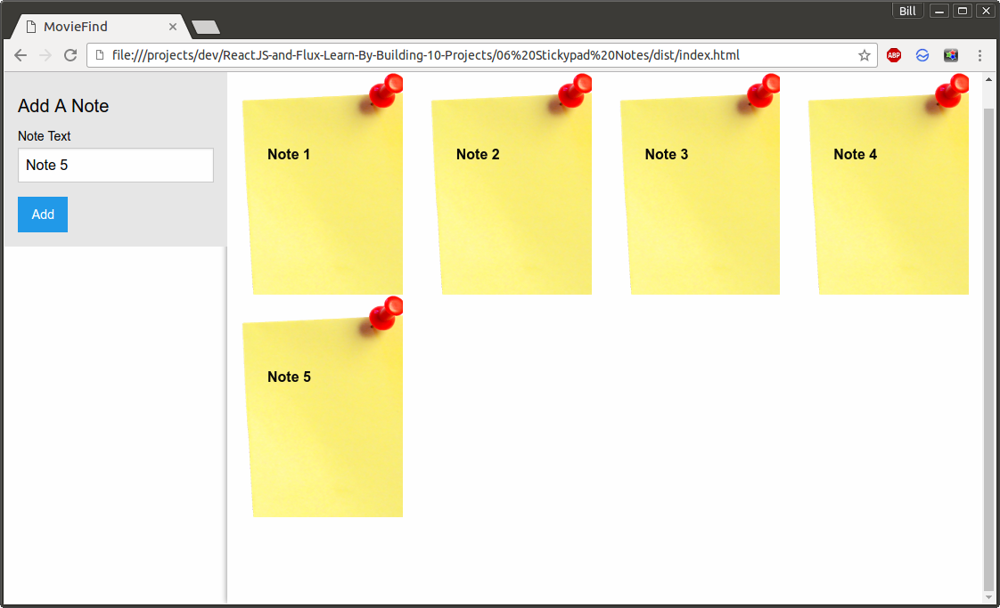

Remove Note by DoubleClick

    # npm list --depth=0
    06_Stickypad_Notes@1.0.0 /projects/06 Stickypad Notes
    ├── browserify@13.1.0
    ├── flux@2.1.1
    ├── gulp@3.9.1
    ├── object-assign@2.1.1
    ├── react@0.14.8
    ├── react-dom@0.14.8
    ├── reactify@1.1.1
    └── vinyl-source-stream@1.1.0

 

### 07 InfoFinder Search Engine

Technologies: DuckDuckGO API

 

002 InfoFinder Fluxboiler Setup

https://duckduckgo.com/api

    $ npm install
    $ gulp

 

003 Search Form

no run

 

004 Fetch Data From DuckDuckGo API

 

005 Display Results

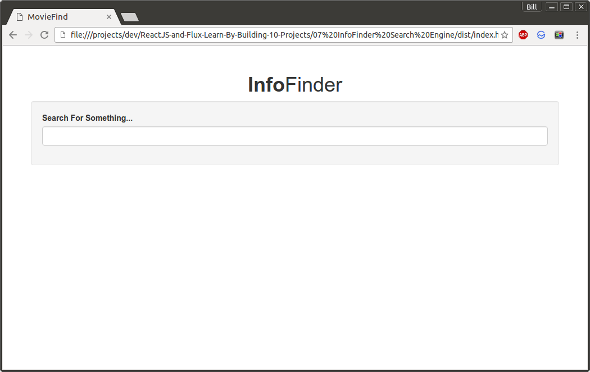

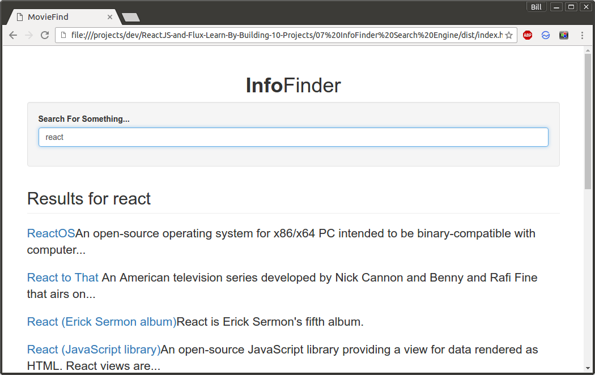

    # npm list --depth=0
    07_InfoFinder_Search_Engine@1.0.0 /projects/07 InfoFinder Search Engine
    ├── browserify@13.1.0
    ├── flux@2.1.1
    ├── gulp@3.9.1
    ├── object-assign@2.1.1
    ├── react@0.14.8
    ├── react-dom@0.14.8
    ├── reactify@1.1.1
    └── vinyl-source-stream@1.1.0

 

### 08 Youtube Gallery

Technologies: Zimit, Firebase

http://firezenk.github.io/zimit/

 

002 Boiler Add Video Form

 

003 Persist Data To Firebase

    $ npm install --save firebase@2.*.*

Create new database:

    App Name: ytgallery1
    App Url: ytgallery1

 

    gulp

 

    Video Title: Enjoykin
    Video ID: id: n-AdoTkXwbc
    Video Description: Some Description

 

004 Displaying Videos
